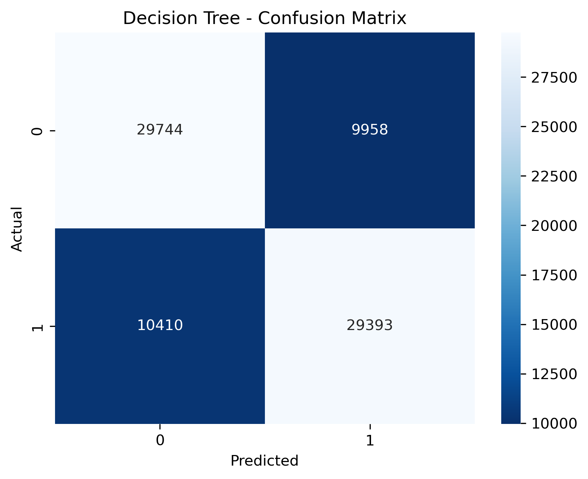
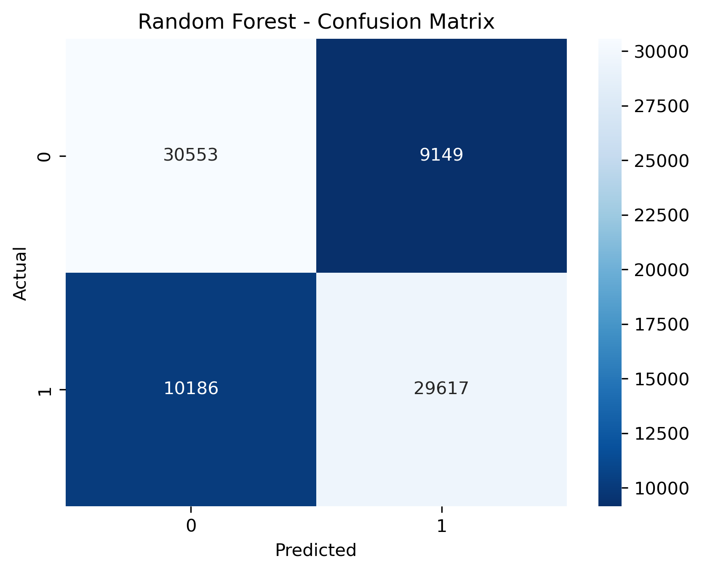
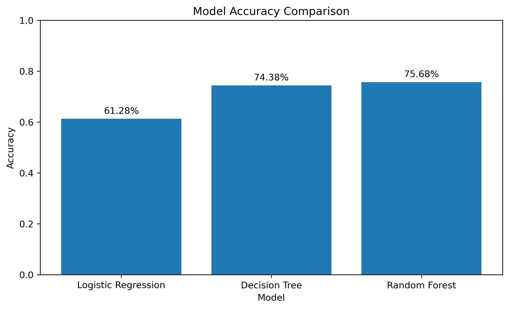

# Airline Delay Classification

A practical **Machine Learning classification project** using airline delay data to predict whether an observation has a **High Delay** or **Low Delay** level.

## Project Objective

The main goal of this project is to practice the complete **binary classification workflow** on a real-world dataset, from data preparation and target creation to model training, evaluation, and visualization.

## Dataset

The dataset contains airline delay information, including:

* Year and month
* Airline carrier
* Airport
* Number of arriving flights
* Number of delayed flights
* Different delay causes
* Total delay information

The target variable was not originally available, so it was created using the delay rate:

```text
delay_rate = delayed flights / arriving flights
```

Observations with a delay rate greater than or equal to the median delay rate were classified as:

* `High_Delay`
* `Low_Delay`

The resulting classes were approximately balanced.

## Features

For the classification task, the following features were used:

* `year`
* `month`
* `carrier`
* `airport`

Categorical features (`carrier` and `airport`) were converted into numerical representations using **One-Hot Encoding**.

## Machine Learning Models

Three classification algorithms were trained and compared:

1. **Logistic Regression**
2. **Decision Tree**
3. **Random Forest**

All models were evaluated using the same train/test split to make the comparison fair.

## Visualizations

### Logistic Regression


### Decision Tree



### Random Forest



### Model Accuracy Comparison



## Evaluation Metrics

The models were evaluated using:

* Accuracy
* Precision
* Recall
* F1-score
* Confusion Matrix

## Results

| Model               |  Accuracy | F1-score |
| ------------------- | --------: | -------: |
| Logistic Regression |      ~61% |    ~0.61 |
| Decision Tree       |      ~74% |    ~0.74 |
| Random Forest       | **75.9%** | **0.76** |

### Best Model

**Random Forest** achieved the best performance among the three tested models, with approximately **75.9% accuracy** and an **F1-score of 0.76**.

## Visualizations

The project includes:

* Confusion matrices for the classification models
* Model performance comparison
* Final accuracy comparison between the three algorithms

## What I Learned

Through this project, I practiced the complete classification workflow:

```text
Data Understanding
       ↓
Target Creation
       ↓
Train/Test Split
       ↓
Categorical Encoding
       ↓
Model Training
       ↓
Prediction
       ↓
Model Evaluation
       ↓
Visualization
       ↓
Model Comparison
```

More importantly, the project helped me understand how different classification algorithms can perform differently on the same dataset.

## Tools & Libraries

* Python
* Pandas
* NumPy
* Matplotlib
* Seaborn
* Scikit-learn
* SciPy
* Jupyter Notebook

## Project Structure

```text
Airline_Delay_Cause_Classification/
│
├── data/
│   └── Airline_Delay_Cause.csv
│
├── notebook/
│   └── classification.ipynb
│
└── README.md
```

## Future Improvements

This project was intentionally kept as a classification practice project rather than a model optimization project.

Possible future improvements include:

* Hyperparameter tuning
* More advanced feature selection
* Testing additional classification algorithms
* Cross-validation
* Improving model performance

Built with Python & Scikit-learn

**Basmala Hussein**
Software Industry & Multimedia Student | Aspiring ML Engineer